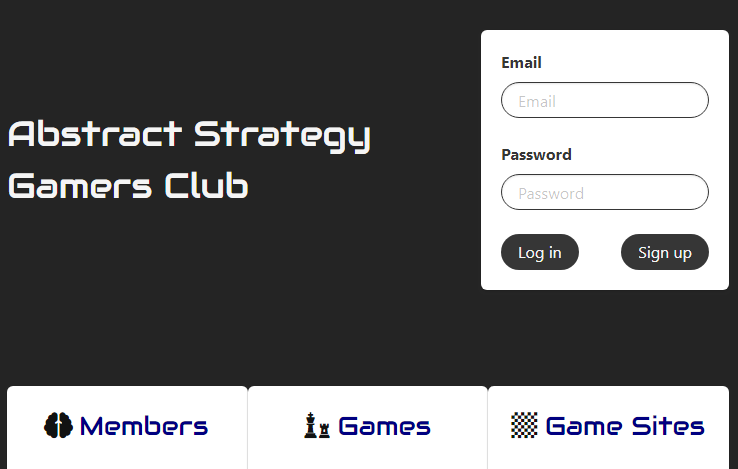

# Abstract Strategy Gamers Club

## A site for fans of abstract strategy games

[Abstract Strategy Gamers Club](https://morning-ravine-10944.herokuapp.com/)

https://morning-ravine-10944.herokuapp.com/

### Allowing users to find fellow players near them, and explore the world of abstract strategy board games.

A web site in development for fans of abstract strategy board games like chess, go, and othello, with a focus on less-well-known abstracts that don’t have the web presence of more popular games like chess.  Allows users to create an authenticated profile that records the games they are interested in playing.  Using information from their profile, it also allow users to find other site members who are interested in playing the same games they are and sorts them by geographical proximity to facilitate setting up in-person gaming sessions or local gaming groups.  Future features will include pages for individual games featuring links to strategy resources, and the ability to form local groups.

#### Created with React, Express, Node, MySQL, Sequelize, Bulma, and geocoding libraries.